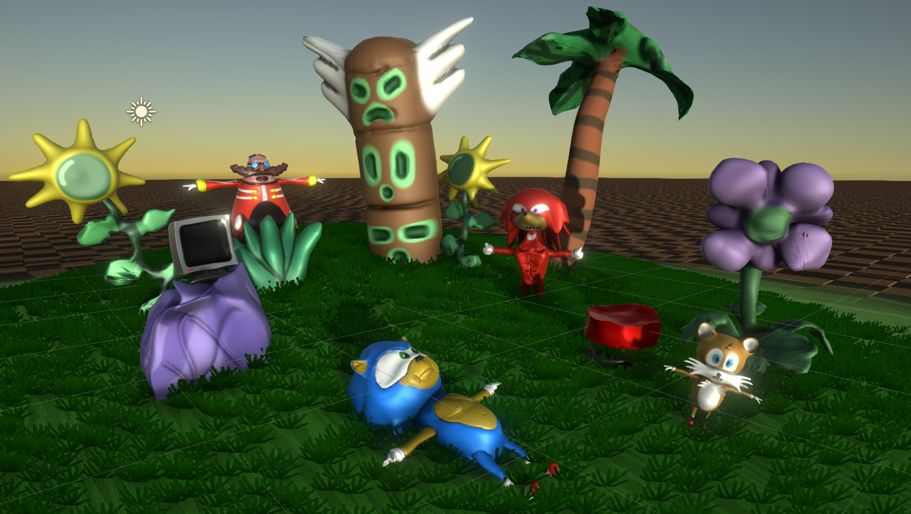

# Project sources for "Sonic Suggests"

Complete source code with resources for Rage 2018 submission - "Sonic Suggests"

I didn't used version control at the time, but i still have original "backup" archives. I reconstructed rough git history from them, so you also can view development progress. There was also quick android port, based on 1.0, i included it aswell in "android" branch

Sadly, i didn't treated it too well, and exact project for version 1.1 is not backed up. Project that i had in the end, have been opened in Unity 2018.4.36f1 at some point, it upgraded assets to newer Unity version and left project in semi-working state. I fixed bugs that were introduced with this upgrade, cleaned it up, and got it working again.

Project was cleaned up, and .blend files were converted to .fbx, so you don't need to have Blender installed.
If you want to look at previous versions, Blender 2.79 is required, so unity can open .blend files.

Used Unity versions:
- 1.1 - 2018.4.36f1
- 1.0 - 2017.3.0f3 / 2017.3.0p2
- Android - 2018.1.0f2

Also, in "AssetsSource" original high poly models in SculptGL and .PLY format, you can open them with https://stephaneginier.com/sculptgl/

# Disclaimer
This repository serves historical purpose, and probably not suited for learning. This is game jam project, and they can be very messy

# License
Go nuts with it, rip assets, port to samsung smart fridge, make "Sonic Suggests 2" (I don't mind, really), now you are the master of this game. 